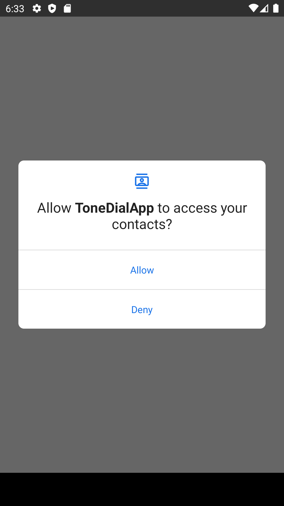
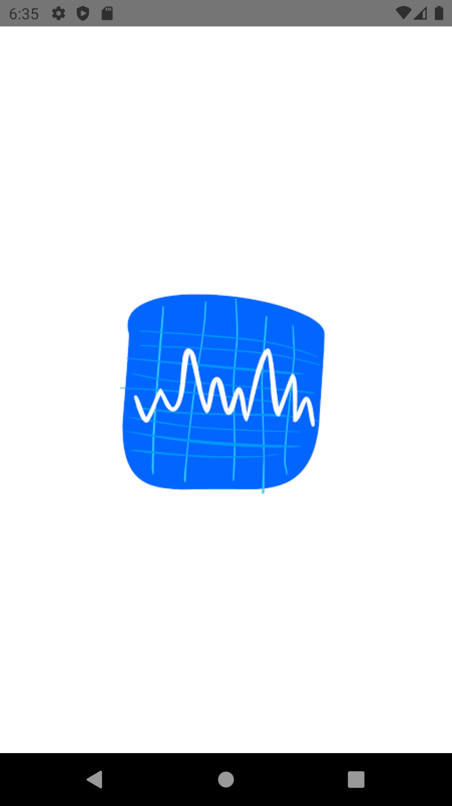
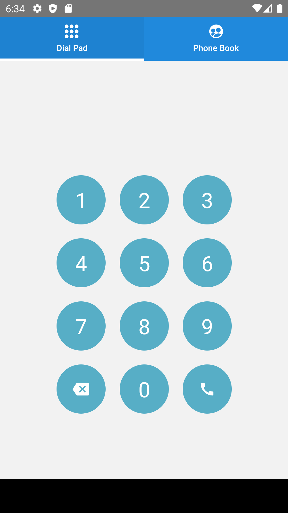
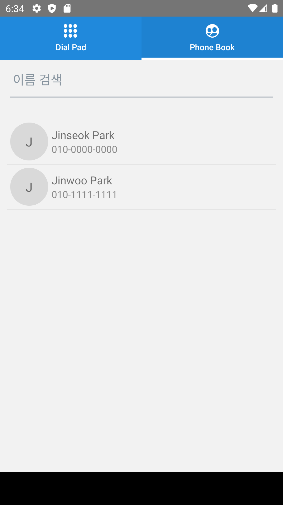

## Tone Dial 개발 설명서  
   
### 1. 개발 환경 구축
   1) Android Studio
   2) Visual Studio Code
   3) Node.js
   4) React Native

### 2. DTMF 이해 및 사용하기
   1) DTMF란?  
      DTMF(dual tone multi frequency)는 일반 전화기의 버튼을 눌렀을 때 발생되어 전화국으로 보내어지는 신호이다.
   2) DTMF를 어떻게 쓸 것인가?
      전화번호를 다이얼 패드에서 입력하고 전화 버튼을 누르면 해당 번호의 DTMF를 실행하여 유선전화에서 바로 전화를 거는 용도로 사용 가능하다. (특히 해외에서는 이 방법으로 바로 국내에 전화할 수 있기에 유용함)  
   3) react-native-dtmf 설치  
      npm 패키지 중 유일하게 react-native와 호환되는 패키지이다. 다만 최종 업데이트가 8년전이기에 일부 문법이 변경된 부분이 존재하여 자체 소스를 일부 수정했다.  
      - node_modules\react-native-dtmf\android에 있는 build.gradle에서 dependencies 에 compile 문법을 implementation으로 변경  
      - node_modules\react-native-dtmf\android\src\main\java\ca\bigdata\voice\dtmf 경로에 BigDataDTMFPackage.java에 @override 전부 삭제  
      - node_modules\react-native-dtmf\android\src\main\java\ca\bigdata\voice\dtmf 경로에 BigDataDTMFModule.java에서 MAC_VOLUME 나누기 삭제함(소리가 너무 작음)
   4) react 소스에서 dtmf 실행하기  
      - DTMF.playTone(DTMF.DTMF_0,400) => 1번째는 다이얼 종류, 두번째는 ms이다.  
      - 소리간 간격이 필요하기에 sleep 함수 생성하고 순차실행을 위해 for-of 사용
      출처 : https://github.com/lucbelliveau/react-native-dtmf#readme

### 3. 연락처 동기화 방법  
   1) react-native-contacts 설치(node.js 서버 내리고 진행)
   2) android\app\src\main\AndroidManifest.xml에서 아래 소스 추가 (추가하지 않으면 이후 메인 소스에서 허가요청이 불가능함)
   ```
   <uses-permission android:name="android.permission.WRITE_CONTACTS" />
    <uses-permission android:name="android.permission.READ_CONTACTS" />
   ```  
   3) 연락처 리스트 디자인 참고  
   출처 : https://blog.logrocket.com/react-native-contacts-how-to-access-a-devices-contact-list/

### 4. 상태관리 Redux 사용하기  
   출처 : https://133hyun.tistory.com/59

### 5. 사용한 주요 패키지 정리
   1) @rneui/themed
   2) react-native-dtmf 
   3) react-native-contacts

### 6. apk 파일로 만들기
   1) assets 폴더 확인  
      android/app/src/main/assets 폴더가 있는지 확인하고 없으면 assets 파일을 만들어준다.  
   2) bundle 파일 생성  
      ```
      npx react-native bundle --platform android --dev false --entry-file index.js --bundle-output android/app/src/main/assets/index.android.bundle --assets-dest android/app/src/main/res/
      ```
      위 코드를 터미널에서 실행하여 bundle 파일을 생성한다.
   3) vscode에서 프로젝트 ```npx react-native run-android ``` 실행
   4) 추출된 /apk 파일 휴대폰으로 옮기기  
      android/app/build/outputs/apk/debug 경로에 apk 파일을 복사하면 된다.  

### 7. 실행화면
   
